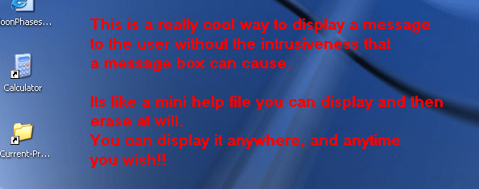



## Transparent Desktop Text \- A Different Method

### Description

Evan's Approach With Transparent Background
 
### More Info
 

             |
---                |---
**Submitted On**   |2004-05-01 13:23:00
**By**             |[Peter\.](https://github.com/Planet-Source-Code/PSCIndex/blob/master/ByAuthor/peter.md)
**Level**          |Beginner
**User Rating**    |4.9 (74 globes from 15 users)
**Compatibility**  |VB 6\.0
**Category**       |[Graphics](https://github.com/Planet-Source-Code/PSCIndex/blob/master/ByCategory/graphics__1-46.md)
**World**          |[Visual Basic](https://github.com/Planet-Source-Code/PSCIndex/blob/master/ByWorld/visual-basic.md)
**Archive File**   |[Transparen173975522004\.zip](https://github.com/Planet-Source-Code/peter-transparent-desktop-text-a-different-method__1-53509/archive/master.zip)

